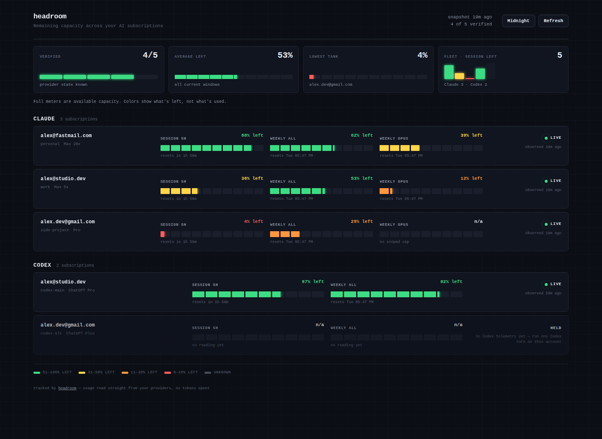
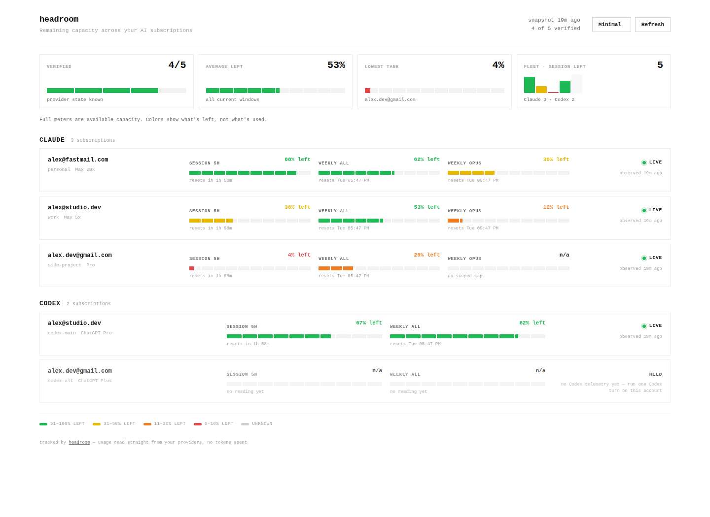
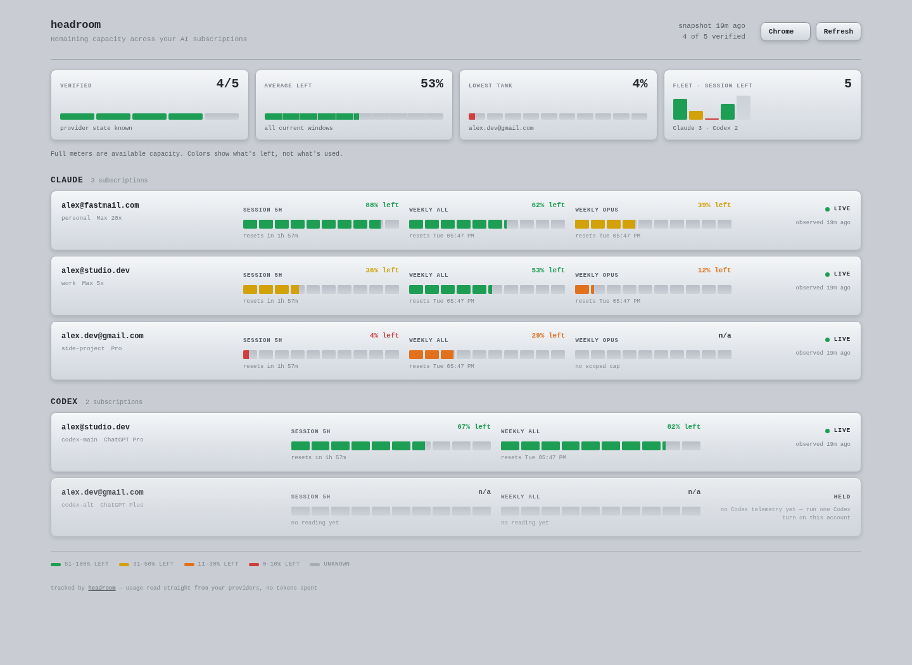
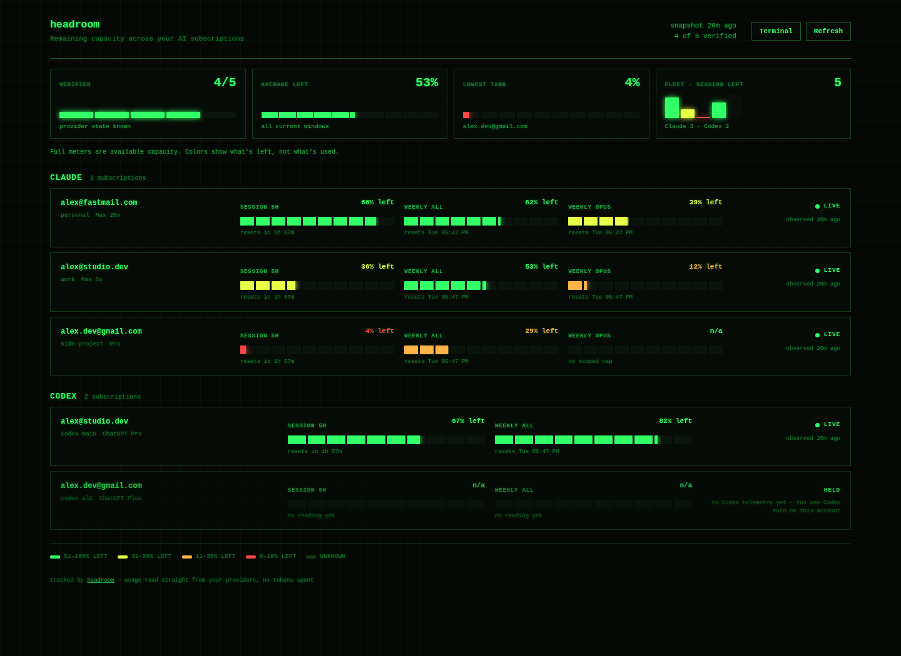

# headroom

**Never hit a Claude or Codex usage limit mid-flight again.**

headroom tracks the remaining capacity of every Claude and ChatGPT/Codex
subscription you own — *without spending a single token* — puts it on a live
dashboard you'll actually want to look at, and rotates your tools to the
account with the most headroom the moment one hits a limit.

| Midnight | Minimal |
|---|---|
|  |  |

| Chrome | Terminal |
|---|---|
|  |  |

Five built-in themes (Midnight, Minimal, Chrome, Paper, Terminal), switchable
live from the dashboard. The setup wizard asks how you want it to look.

## Why this exists

If you run more than one Claude or ChatGPT subscription (work + personal +
team), you know the drill: a session dies with *"you've hit your limit"*, you
have no idea how much is left on the other accounts, and you burn ten minutes
logging in and out to find out.

headroom fixes all three problems:

1. **See** — every account's 5-hour, weekly, and model-scoped windows on one
   page, color-coded by what's *left*, not what's used.
2. **Read for free** — usage comes from the same endpoints your CLIs already
   use (Anthropic's OAuth usage API; Codex's on-disk session telemetry).
   Checking your limits never consumes them.
3. **Rotate** — `headroom claude` launches on the first account in your
   preference order with *proven* headroom. When a limit hits,
   `headroom rotate` (or the `/rotator` skill inside Claude Code) cools that
   login down until its window resets and hands you the next one.

## Quickstart

Requirements: Python 3.9+ (stdlib only — no pip installs), macOS or Linux,
and the `claude` and/or `codex` CLIs you already use. (On macOS, connect
Claude accounts with a fresh `headroom connect` login rather than adopting the
Keychain-backed default — see [docs/KNOWN-LIMITS.md](docs/KNOWN-LIMITS.md).)

```bash
git clone https://github.com/pauldomanski/headroom
cd headroom
./install.sh              # symlinks bin/headroom onto your PATH
headroom serve --demo     # OPTIONAL: preview it now with sample data, no setup
headroom setup            # the wizard: connects accounts, styles your dashboard
```

Want to see it before connecting anything? `headroom serve --demo` opens the
dashboard on bundled sample data — it's exactly what the screenshots show.

The wizard finds logins already on your machine (`~/.claude`, `~/.codex`) and
adopts them in place — credentials are never moved, copied, or read beyond
what's needed to verify who's logged in. Extra accounts get their own isolated
config home and log in through the provider's own flow.

Then:

```bash
headroom serve --open      # live dashboard at http://127.0.0.1:8377
headroom status sonnet     # who has capacity right now, and why not
headroom claude            # launch Claude Code on the best account
headroom rotate            # limit hit? cool this login, switch to the next
```

## The commands

| command | what it does |
|---|---|
| `headroom setup` | first-run wizard: accounts + dashboard style quiz |
| `headroom connect` | add another account (guided login, clobber-proof) |
| `headroom collect` | refresh usage for every account (no tokens spent) |
| `headroom status [model]` | table: every account, its windows, and exactly why any is skipped |
| `headroom pick <model>` | print the best account name (exit 2 if none) — script-friendly |
| `headroom env <model>` | print the `export CLAUDE_CONFIG_DIR=...` line for the best account |
| `headroom claude` / `codex [args]` | launch the CLI on the best account |
| `headroom run <model> -- <cmd>` | headless run with automatic rotation on limit-hit |
| `headroom rotate [model]` | cool the current account, hand you the next |
| `headroom serve [--open]` | local live dashboard (auto-refreshes stale data) |
| `headroom serve --demo` | preview the dashboard with bundled sample data — no accounts needed |
| `headroom statusline` | color-coded capacity for your Claude Code status line |
| `headroom doctor` | environment + config health check (handy for bug reports) |

## How the reads work (and why they're safe)

- **Claude — real-time.** Your login token already has access to
  `api.anthropic.com/api/oauth/usage`, the endpoint the Claude apps themselves
  use to draw their usage UI. headroom calls it read-only and verifies the
  organization the response belongs to matches the login bound to that slot —
  a swapped or clobbered login can never report another account's headroom.
  Claude usage is always live.
- **Codex — best-effort.** The Codex CLI writes `rate_limits` telemetry into
  its session logs on every turn, and headroom reads the newest event from
  disk (zero network). This means Codex usage is live *while you're using
  Codex* and shows an honest **`Idle · last seen …`** state when an account
  has been quiet, or **`Waiting · run Codex once to start tracking`** before
  it has ever run. It never fabricates a reading. A live Codex read (via the
  Codex app-server) is on the roadmap; until then, treat Codex as an
  informative best-effort panel, not a real-time gauge.

If you only run Claude, headroom is a fully real-time tool — Codex support is
purely additive and every account is optional.
- Snapshots are written atomically. The dashboard gets a sanitized projection
  (optionally with emails redacted) — raw identity material stays in the
  private state directory with `0600` permissions.

## Fail-closed by design

headroom never guesses. An account with a stale reading, an unverifiable
identity, an out-of-range percentage, or an active cooldown is *held* — shown
on the dashboard as held, skipped by the router, with the reason spelled out
in `headroom status`. If no account has proven capacity, `pick` says so with a
non-zero exit instead of pointing you at a login that will die mid-task.

Connecting accounts is protected the same way: a fresh login that turns out to
be an account you already connected is rolled back and refused, because two
slots silently sharing one login is how you eat a week's quota by accident.

## Claude Code integration

See [integrations/claude-code](integrations/claude-code/) — a status line
showing live capacity at the bottom of every session, and a `/rotator` skill
so Claude can rotate accounts for you when a limit hits.

## Hosting the dashboard somewhere else

`headroom dashboard` builds two static files (`index.html` + `usage.json`)
in `~/.headroom/state/public/`. Put them behind any static host or reverse
proxy; add a cron for `headroom collect` to keep the JSON fresh. Turn on
`redact_emails` in setup if the page might be visible to others.

## Security posture

The engine was adversarially reviewed cross-model (GPT-5.6 at x-high
reasoning effort) before first release; every fixable finding is patched and
the deliberate tradeoffs are documented in
[docs/KNOWN-LIMITS.md](docs/KNOWN-LIMITS.md). Highlights: auth-override
environment variables are scrubbed from every provider subprocess, usage
snapshots are atomic with a sanitized public projection (emails redacted by
default), authenticated requests never follow redirects, corrupt protective
state holds routing instead of clearing it, and stale data is always shown
as held — never promoted to live.

## A note on multiple accounts

headroom manages accounts you legitimately hold — a personal plan, a work
plan, a team seat. It doesn't create accounts, share credentials, or bypass
provider controls; it just routes your own tools at your own logins and tells
you what's left. Check your providers' terms if you're unsure what applies
to your setup.

## License

MIT — see [LICENSE](LICENSE).
