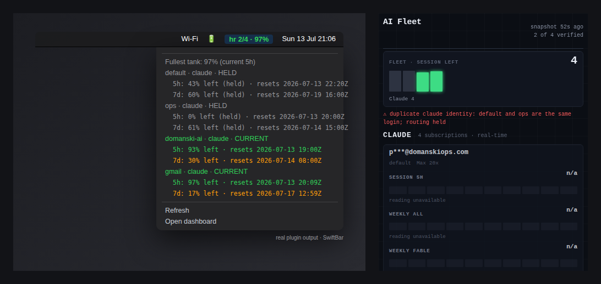

# headroom

**Never hit a Claude or Codex usage limit mid-flight again.**

headroom tracks the remaining capacity of every Claude and ChatGPT/Codex
subscription you own — *without spending a single token* — puts it on a live
dashboard you'll actually want to look at, and rotates your tools to the next
account with headroom the moment one hits a limit.

https://github.com/user-attachments/assets/71e8ec51-8f0f-4ec2-806f-221b9eb6571f

Five built-in themes (Midnight, Minimal, Chrome, Paper, Terminal), switchable
live from the dashboard. The setup wizard asks how you want it to look.

<details>
<summary>All five themes (static)</summary>

| Midnight | Minimal |
|---|---|
|  |  |

| Chrome | Terminal |
|---|---|
|  |  |

</details>

## Why this exists

If you run more than one Claude or ChatGPT subscription (work + personal +
team), you know the drill: a session dies with *"you've hit your limit"*, you
have no idea how much is left on the other accounts, and you burn ten minutes
logging in and out to find out.

headroom fixes all three problems:

1. **See** — every account's 5-hour, weekly, and model-scoped windows on one
   page, color-coded by what's *left*, not what's used.
2. **Read for free** — usage comes live from the same reads your CLIs already
   use (Anthropic's OAuth usage API; the Codex app-server's rate-limits read).
   Checking your limits never consumes them.
3. **Rotate** — `headroom claude` launches on the first account in your
   preference order with *proven* headroom. When a limit hits,
   `headroom rotate` (or the `/rotator` skill inside Claude Code) cools that
   login down until its window resets and hands you the next one. Set a
   **reserve** (e.g. 10%) and it skips any account already below that much
   headroom, so a session starts fresh instead of hitting a wall mid-task.

## New in v0.2: automatic Claude conversation handoff

Automatic handoff is **on by default** — uninterrupted continuation is the
point of headroom. `headroom claude` stays resident around an interactive
Claude process. If that exact session reaches a subscription cap, headroom
requires three independent proofs before it acts: a current-session `StopFailure` hook matched as
`rate_limit`, a narrow session/weekly-cap message, and a new identity-bound
usage read showing at least 99% used in the corresponding account or model
window. The active model family comes from the final API-error transcript
event, not the model used when the session launched. Missing or ambiguous
evidence leaves Claude running.

After every non-mutating preflight succeeds, headroom sends Claude one
`SIGTERM`, requires its `SessionEnd` cleanup hook, verifies the final transcript
again, publishes a byte-identical copy without overwriting anything in the
target account, and resumes with a forked session. The source transcript is
never modified. If post-stop validation fails, the source session is relaunched
with automation disabled. Three automatic handoffs in any rolling ten minutes
trips the loop guard; the fourth child stays alive.

Turn it off in `headroom setup`, or explicitly in config:

```json
{
  "routing": {
    "reserve_percent": 0,
    "auto_handoff": false
  }
}
```

One-run overrides are `headroom claude --headroom-auto-handoff` and
`--headroom-no-auto-handoff`. Supervision only activates when stdin, stdout,
and stderr are TTYs and no hook-incompatible Claude flag is present; otherwise
the normal direct-exec launch path is used.

What carries is the conversation, model-family routing, and latest session cwd.
Background tasks, live MCP connections, pending MCP/permission approvals,
permission mode, and other ephemeral launch flags do not carry. If termination
races a tool call, Claude may re-drive that interrupted call on resume; headroom
prints a notice because a side effect could therefore execute twice. See
[Known limits](docs/KNOWN-LIMITS.md) before enabling automation on a new
platform.

## Quickstart

Requirements: Python 3.9+ (stdlib only — no pip installs), macOS or Linux,
and the `claude` and/or `codex` CLIs you already use. (On macOS the Claude
token lives in the login Keychain; headroom reads it directly — approve the
Keychain prompt on first run. Multiple Claude accounts on one Mac need a
current Claude Code version — see
[docs/KNOWN-LIMITS.md](docs/KNOWN-LIMITS.md).)

```bash
git clone https://github.com/domanski-ai/headroom
cd headroom
./install.sh              # symlinks bin/headroom onto your PATH
headroom serve --demo     # OPTIONAL: preview it now with sample data, no setup
headroom setup            # the wizard: connects accounts, styles your dashboard
```

Want to see it before connecting anything? `headroom serve --demo` opens the
dashboard on bundled sample data — it's exactly what the screenshots show.

The wizard finds logins already on your machine (`~/.claude`, `~/.codex`) and
adopts them in place — credentials are never moved, copied, or read beyond
what's needed to verify who's logged in. Extra accounts get their own isolated
config home and log in through the provider's own flow.

Then:

```bash
headroom serve --open      # live dashboard at http://127.0.0.1:8377
headroom status sonnet     # who has capacity right now, and why not
headroom claude            # launch Claude Code on the best account
headroom rotate            # limit hit? cool this login, switch to the next
```

## Widgets



Widgets are display-only views of the same fail-closed public snapshot. The
mini dashboard app is the existing dashboard in a compact layout: open
`http://127.0.0.1:8377/widget`, or add `?compact=1` to the normal dashboard URL.
It keeps stale, held, limited, and offline state visible; it does not rotate or
select accounts.

### SwiftBar on macOS

Install [SwiftBar](https://swiftbar.app/), make sure the installed `headroom`
binary is on SwiftBar's `PATH`, then copy the one-minute plugin into SwiftBar's
plugin folder:

```bash
mkdir -p "$HOME/Library/Application Support/SwiftBar/Plugins"
cp integrations/swiftbar/headroom.1m.sh \
  "$HOME/Library/Application Support/SwiftBar/Plugins/headroom.1m.sh"
chmod +x "$HOME/Library/Application Support/SwiftBar/Plugins/headroom.1m.sh"
headroom serve
```

Local mode runs `headroom widget-feed --swiftbar`, which renders the last
published snapshot and never initiates collection. The live server's
`/usage.json`, `/widget.json`, and `/widget.txt` feeds share one refresh gate.
The menu shows the fullest current 5-hour tank plus both windows and reset times
for every account. Its only actions are Refresh and Open dashboard.

For a headroom server on another machine, keep the server bound to loopback and
forward it over SSH. This is the only supported remote pattern for live widget
feeds:

```bash
ssh -N -L 8377:127.0.0.1:8377 user@headroom-host
launchctl setenv HEADROOM_WIDGET_URL http://127.0.0.1:8377
```

Restart SwiftBar after setting the environment variable. Do not expose
`headroom serve` on a LAN, public interface, or reverse proxy. It remains
loopback-only, validates the `Host` header, sends no CORS allowance, and marks
all responses `no-store` and `nosniff`. Remote plugin fetches have a three-second
timeout and 64 KB cap. The exact `headroom_widget_txt@1` sentinel is version
validation, not authentication; the plugin never evaluates, sources, or
executes fetched bytes. Server-rendered menu text is centrally sanitized and
contains no SwiftBar shell-execution parameters.

### Windows tray — EXPERIMENTAL

The Windows tray client is **EXPERIMENTAL**, not stable or supported as a
production integration. Make the server available at loopback (for example,
with the SSH tunnel above), preserve the four files under
`experimental/windows/icons/`, and launch it from the repository root with
Windows PowerShell 5.1:

```powershell
powershell -ExecutionPolicy Bypass -File experimental/windows/headroom-tray.ps1
```

It uses bundled green, amber, red, and gray icons, caps the Windows tooltip at
63 characters, and offers Refresh and Open dashboard. Any HTTP, JSON, schema,
or clock failure becomes gray `OFFLINE`. A real Windows 10/11 PowerShell 5.1
E2E pass is still required before the experimental label can be reconsidered;
Windows requesters are invited to validate startup, all four transitions, both
menu actions, and clean exit.

## The commands

| command | what it does |
|---|---|
| `headroom setup` | first-run wizard: accounts + dashboard style quiz |
| `headroom connect` | add another account (guided login, clobber-proof) |
| `headroom collect` | refresh usage for every account (no tokens spent) |
| `headroom status [model]` | table: every account, its windows, and exactly why any is skipped |
| `headroom pick <model>` | print the best account name (exit 2 if none) — script-friendly |
| `headroom env <model>` | print the `export CLAUDE_CONFIG_DIR=...` line for the best account |
| `headroom claude` / `codex [args]` | launch the CLI on the best account; Claude supervises auto-handoff when opted in |
| `headroom run <model> -- <cmd>` | headless run with automatic rotation on limit-hit |
| `headroom rotate [model]` | cool the current account, hand you the next |
| `headroom handoff` | transactional manual handoff (`--yes`, `--print`, `--model FAMILY`) |
| `headroom serve [--open]` | local live dashboard (auto-refreshes stale data) |
| `headroom serve --demo` | preview the dashboard with bundled sample data — no accounts needed |
| `headroom widget-feed --swiftbar` | render the last published snapshot for SwiftBar; never collects |
| `headroom statusline` | color-coded capacity for your Claude Code status line |
| `headroom doctor` | environment + config health check (handy for bug reports) |

## Hand off a capped session

**EXPERIMENTAL.** With automatic handoff off, after Claude reaches its cap run `/exit`, then run
`headroom handoff`. It verifies and copies the conversation transcript to the
best other Claude account, cools the capped slot, and resumes from the same
working directory with a new session id. Use `--print` to stage the handoff and
print the exact resume command without running it; use `--yes` for a confirmed
non-interactive handoff. If the journal lacks a model, pass `--model FAMILY`.
`FAMILY` must name a scoped Claude family such as `sonnet`, `opus`, `haiku`, or
`fable`; generic `claude` is not enough to enforce model-scoped caps.
`--yes` and `--print` are mutually exclusive. The source transcript is never
changed or deleted. Every manual handoff refuses an unresolved tool call unless
`--force` is given; even a 99–100% provider snapshot is cooldown evidence, not
authenticated cap proof.

## How the reads work (and why they're safe)

- **Claude — real-time.** Your login token already has access to
  `api.anthropic.com/api/oauth/usage`, the endpoint the Claude apps themselves
  use to draw their usage UI. headroom calls it read-only and verifies the
  organization the response belongs to matches the login bound to that slot —
  a swapped or clobbered login can never report another account's headroom.
  Claude usage is always live.
- **Codex — real-time.** headroom reads Codex usage live from the Codex
  **app-server** (`codex app-server` → `account/rateLimits/read` +
  `account/read`), bound to each account's own config home. That's a live,
  identity-verified read of the same rate-limit data ChatGPT/Codex uses — not
  a scrape of stale session logs — so Codex usage is as current as Claude's,
  and Codex accounts are **routed and rotated** just like Claude ones.
  (On an older Codex CLI without the app-server, headroom falls back to a
  best-effort session-log read and the router holds those accounts until a
  fresh reading appears.)

Every account is optional — run only Claude, only Codex, or both. Both
providers are read live, identity-bound, and fully routed.
- Snapshots are written atomically. The dashboard gets a sanitized projection
  (optionally with emails redacted) — raw identity material stays in the
  private state directory with `0600` permissions.

## Fail-closed by design

headroom never guesses. An account with a stale reading, an unverifiable
identity, an out-of-range percentage, or an active cooldown is *held* — shown
on the dashboard as held, skipped by the router, with the reason spelled out
in `headroom status`. If no account has proven capacity, `pick` says so with a
non-zero exit instead of pointing you at a login that will die mid-task.

Connecting accounts is protected the same way: a fresh login that turns out to
be an account you already connected is rolled back and refused, because two
slots silently sharing one login is how you eat a week's quota by accident.

## Claude Code integration

See [integrations/claude-code](integrations/claude-code/) — a status line
showing live capacity at the bottom of every session, and a `/rotator` skill
so Claude can rotate accounts for you when a limit hits.

## Keeping sessions fresh (reserve)

By default headroom uses each account right down to its limit. If you'd rather
not *start* a session on an account that's about to run out, set a reserve —
the setup wizard asks, or add it to `~/.headroom/config.json`:

```json
{ "routing": { "reserve_percent": 10, "auto_handoff": false } }
```

Now any account with less than 10% headroom left on its 5-hour, weekly, or
model-scoped window is skipped in favour of a fuller one (and `headroom status`
shows exactly why). `0` (the default) keeps today's use-to-the-limit behaviour.

## Reserving an account (tracked, never routed)

Mark an account `"reserved": true` in `~/.headroom/config.json` to keep it on
the dashboard and in `headroom collect` while excluding it from routing
entirely: it is never returned by `pick`/`env`, never launched by
`headroom claude`/`codex`, and never chosen as a rotation or handoff target.
Use it for a login that belongs to some other workflow (a desktop app, a
teammate, a pinned service) that automatic rotation must not consume.

## Driving headroom from scripts

Six affordances make headroom composable with launch wrappers:

- **An exported config home is honoured.** If `CLAUDE_CONFIG_DIR` (or
  `CODEX_HOME`) is already set and names a registered account, that account is
  used as the *initial* slot instead of being re-routed — your wrapper's
  routing decision is consumed, not overridden. Rotation off it when it caps
  is unchanged, and if it has no proven headroom, headroom says so on stderr
  and picks another.
- **`HEADROOM_LAUNCH_MARKER=/abs/path.json`** makes `headroom claude`/`codex`
  write a small JSON file at the moment routing commits to launching the CLI
  (`{"mode": "supervised"|"exec", "account": ..., "note": ...}`; `note`
  carries the auto-handoff downgrade reason when supervision was requested
  but unavailable). The marker is written *before* the CLI starts, so a
  wrapper that wants a bare-CLI fallback can treat "headroom exited with no
  marker" as "the CLI never started" and launch directly — without ever
  racing a CLI headroom did start. If a requested marker cannot be written,
  headroom refuses to launch (exit 2) rather than leave the handshake
  dangling.
- **`--headroom-launch-fallback`** (or `HEADROOM_LAUNCH_FALLBACK=1`) makes
  `headroom claude`/`codex` exec the *bare* CLI in-process — same passthrough
  args, headroom's own flags removed — when anything fails strictly **before**
  the first CLI process was started: no routable account, a failed usage
  collect, an unwritable settings file or marker, a failed spawn. Once a CLI
  has started, a later exit — clean or capped — is a normal exit and never a
  fallback; a supervised session that eventually runs out of accounts isn't
  one either. Off by default; with it on, a wrapper can simply `exec headroom
  claude …` and never needs an external bare-CLI fallback of its own.
- **`HEADROOM_NOTIFY_CMD=<command>`** invokes your command at launch
  transitions with one JSON argument: `{"event": "launch", "mode":
  "supervised"|"exec", "account": …, "model": …, "note": …}` when the launch
  commits, `{"event": "downgrade", …}` when supervision was requested but the
  run is exec-only, `{"event": "supervision_lost", …}` when a supervised
  child's auto-handoff disarms after launch (e.g. the SessionStart hook never
  bound), and `{"event": "fallback", …}` when the bare-CLI fallback fires.
  Delivery is bounded (10s hard timeout, override with
  `HEADROOM_NOTIFY_TIMEOUT`); a broken or hung command is swallowed with a
  stderr line and never delays or kills the launch. Events replace external
  marker-polling and are independent of `HEADROOM_LAUNCH_MARKER`.
- **`HEADROOM_SLOT_LEASE=1`** writes a small pid lease under
  `~/.headroom/state/leases/` at the moment routing commits to an account, and
  treats an account whose lease is held by a *live different pid* as
  unavailable — so two concurrent launches deterministically pick different
  accounts instead of both grabbing the registry-first one. A lease whose pid
  is dead is stale (ignored and cleaned); the lease is released on normal
  exit and pid-death covers crashes and exec'd CLIs. Corrupt lease files are
  treated as "no lease" and can never crash routing.
- **`headroom caps`** prints the scripting capabilities this binary supports
  as JSON — `{"schema": 1, "launch_marker": true, "launch_fallback": true,
  "notify_cmd": true, "slot_lease": true}` — so a launcher can refuse or
  adapt to an older binary instead of assuming a feature exists.

## Running across multiple machines

Usage is read **per account, from the provider's side** — so it's correct no
matter how many machines a given login is signed in on, and the reads are
token-safe: checking your headroom never disturbs or logs out your other
sessions. Run headroom on each machine against the logins it has. To view a
live server from another machine, use the Widgets section's `ssh -L` loopback
forward; for ordinary static hosting, use `headroom dashboard` as described
below. Each machine keeps its own cooldown ledger; there's no central
coordinator to stand up.

## Hosting the dashboard somewhere else

`headroom dashboard` builds two static files (`index.html` + `usage.json`)
in `~/.headroom/state/public/`. Put them behind any static host or reverse
proxy; add a cron for `headroom collect` to keep the JSON fresh. Turn on
`redact_emails` in setup if the page might be visible to others.

## Security posture

The engine was adversarially reviewed cross-model (GPT-5.6 at x-high
reasoning effort) before first release; every fixable finding is patched and
the deliberate tradeoffs are documented in
[docs/KNOWN-LIMITS.md](docs/KNOWN-LIMITS.md). Highlights: auth-override
environment variables are scrubbed from every provider subprocess, usage
snapshots are atomic with a sanitized public projection (emails redacted by
default), authenticated requests never follow redirects, corrupt protective
state holds routing instead of clearing it, and stale data is always shown
as held — never promoted to live.

## A note on multiple accounts

headroom manages accounts you legitimately hold — a personal plan, a work
plan, a team seat. It doesn't create accounts, share credentials, or bypass
provider controls; it just routes your own tools at your own logins and tells
you what's left. Check your providers' terms if you're unsure what applies
to your setup.

## License

MIT — see [LICENSE](LICENSE).
